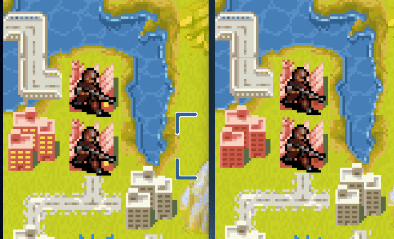
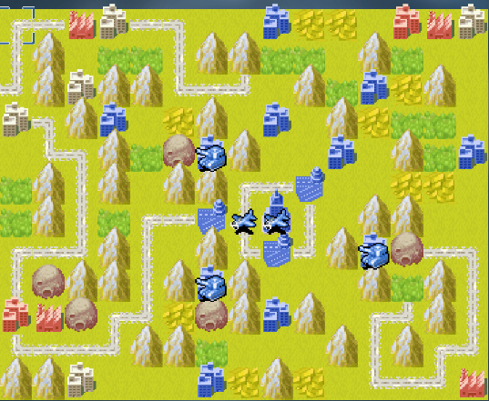

Greetings, commanders.  
    We didn't have content updats in recent months. Yet we didn't abandon this game. Actually in a discussion regarding future updates, we came to the conclusion that the previous framework was not friendly to extend. Therefore, babygogogo decided to remake the game.  
    Given the numerous changes a test server has been introduced. You can click [here](https://tinywars.online/game/test/index.html) to visit the test server.  
    While remaking the game some systems were revamped based on past feedback. They are listed below.  

## Improvements of Interactive
　  A good interactive is important for any pleasant game experience. Some improvements were introduced for a smoother gameplay.  
* **Ambiguous action and unnecessary cursor movement**：Action menu now pops up next to the unit to minimize mouse/finger movement.  Movement expectation does not disappear after planning a move, making revision easier.  
  
"Set path" option was enabled in "Advanced" options, which calls for an extra click to call up the action menu. As a result, players can adjust the movement route without getting blocked by the menu.  
It is an update currently being tested. You can contact the development team for anything unclear.  
* **Updates in vision effect**：In order not to distract players city animation was slowered down. (From 4 per sec to 1 per sec) The following display shows the difference. The old version is on the left while the new version is on the right. The lights on the city change less frequently.  
  
When the whole map is not showed, you can move the cursor to the map edge to move the camera.  
  
Damage expectations will not be blocked by other windows.  
  
You can now enter the game without previewing the setting of the game.  
* **Tags for simulation**：You can now give your simulation a tag to mark simulation for different circumstances.  

Our goal is to make the UI friendly to new comers, and the UI will be updated based on feedbacks in the future. If you have any suggestion please contact the development team.  

## Room System
To cover various needs the Room system has been introduced.  
You can now kick out a player. Revising the game setting in the room page will be available in the future.  

## Updates regarding competitive gameplay
We aim for a diversed gameplay. And for a better competitive gameplay we experiemented with the troop data and map structure.  
### Updates in troop data
Some units are rarely used with in-cart data. In the new troop data by ngc6240 many units are given a different role.  
  
From the new damage chart above you can find that duster is now a better anti-vehicle aircraft.  
Units like antitanks, wartanks and carriers are given new roles as well. You can check the damage chart for more info.  
### Ranking System
Testing season is already online. Players can now set the ranked game number in  "Ranking Match". The map pool and information about the system will be explained in detail in another article.  
It is worth noting that the cocurrent game numbers for FOW and standard games are separated. Each time you got a game the number will reduce by 1. Numbers for FOW and std need to be revised separately. When you clicked "FOW" option any unsaved cocurrent game number will disappear. You need to use "Confirm" for the setting.  

Besides the forementioned updates map rules are also updated. You can visit the test server to check it out.  
## Plans for the future
Our updates will not be limited to these and here are some issues we plan to work on.  

### Short-term goal:
- **Single Player Mode**。Other than the Free Battle Mode, Warroom will be introduced as well. Use your technique to get the high score.  
  

### Long-term goal：
- **Formal replacement of the old verson**。  
Substituting the old verson: Now you can visit the old version when visiting tinywars.online. When everything got settled the website will direct you to the test server instead. You need to add /legacy behind the website to visit the old version by then. And the old version will not receive updates other than maps.  
- **Better in-game map editor**。Players can now change the game setting for the game beginning.  

Thanks for playing tinywars. Welcome to official QQ group or Discord to voice your opinion!  

—— Rush_FTK
