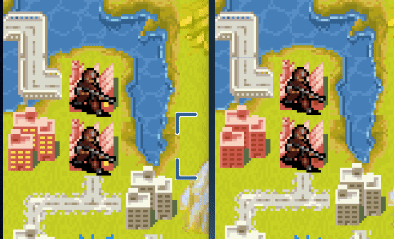
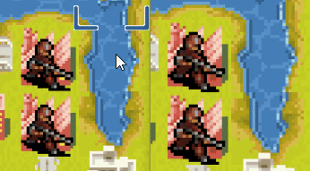
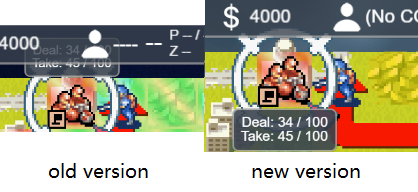
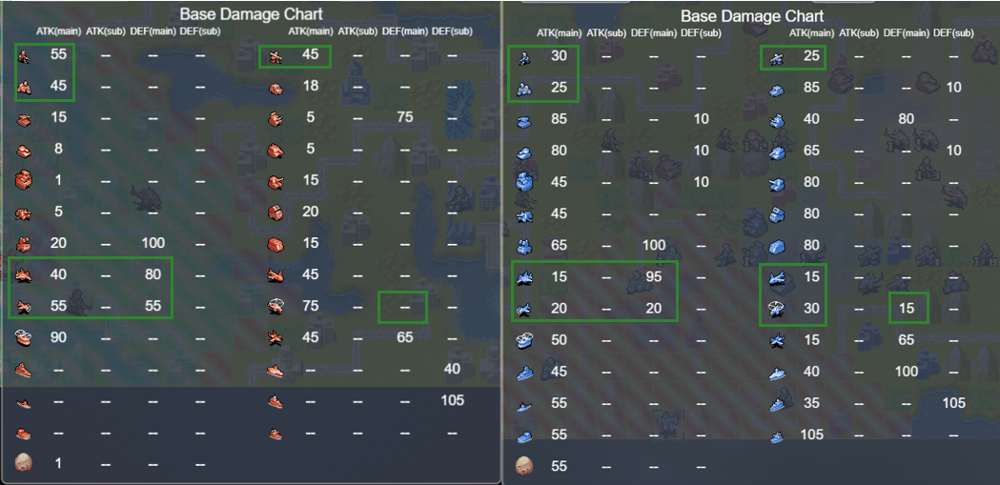
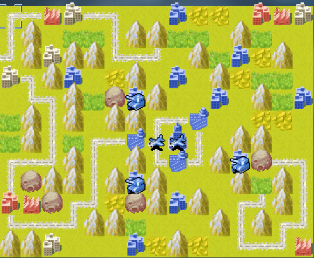

各位指挥官，好久不见！  
　　在最近的数月中我们一直没有进行内容更新，但这并不代表我们放弃了这款游戏。事实上，在对未来内容的研讨中，我们发现现有的框架很难进行扩展，会影响进一步开发。因此Babygogogo重做了全部代码。  
　　由于改动较大，我们引入了测试服，您可以点击[这里](https://tinywars.online/game/test/index.html "测试服游玩地址")访问测试版。    
　　在进行代码重构的同时，我们根据先前的体验反馈，重新设计了若干系统，来一起看一下把：

## 用户操作体验提升
　　玩家操作是否方便与游戏体验息息相关，我们针对旧版本中存在的诸多影响玩家操作流畅度问题进行了优化。  
* **操作歧义与不必要的指针移动**：现在菜单将显示在操作单位旁以减少鼠标或手指的移动距离。此外，现在即使到达目标地点，移动预览也不再消失，因此可以方便的修改目标位置。
  
此外，在“高级”选项中引入了`Set Path`选项，允许二次点击才显示菜单，以便于玩家不会因为菜单阻挡而无法调整路径。  
该项更新为试验性更新，如果您对操作感到困惑，欢迎随时与开发组进行反馈。    
* **视觉效果更新**：为了减小对玩家的注意力影响，减小下降城市动画速度的切换速度(从4帧变为1帧)。 下面的动画演示中，左侧为旧版，右侧为新版。可以看到，城市的灯光不再频繁闪烁了。   
  
此外，在地图显示不完整的情况下，指针会进行移动。  
  
伤害预览不再会被其他界面元素遮挡。   
  
现在可以直接进入对局而不用每次都进行房间设置预览。  
* **模拟战标签**：现在你可以为模拟战设置一个自定义标题，方便标记对不同情况的模拟演示。  

我们的目标是令玩家不再需要时间适应操作，未来还将继续进行考察与更新。如果您有任何建议，欢迎对开发组进行反馈！  

## 房间系统
为了满足多方面需求，我们引入了房间系统。   
现在可以进行请出玩家的操作，未来还将支持修改房间设定等内容。敬请期待。  

## 竞技性更新
我们致力于提供多样性的竞技环境。因此我们将试验性的从单位数据，地图结构等多方面入手，以提升玩家的竞技体验。  
### 单位数据更新
注意到原始的单位中，部分单位的出场机会较低。在ngc6240设计的全新的单位数据中，部分单位的定位被修正。

从上面的伤害表更新中您可以看到，Duster现在将会是一个更优秀的对抗地面机械的高空单位。  
同样的，AntiTank，WarTank，Carrier等单位的定位均有更新，欢迎查阅了解。  
### 天梯系统
测试赛季现已开放。玩家现在可以在`Ranking Match`中设定对局数量进行体验，关于使用的图池以及系统说明我们将会在一篇文章中详细描述。  
需要注意的是，明战与雾战的最大匹配局数相互独立。数值不支持同时修改，当您切换"Fog"选项时，已经修改的明战匹配局数数值将会被丢弃，因此需要分别点选Confirm进行设定。  

除了上述所说的更新之外，我们对地图规则设定等也进行了更新，欢迎访问测试服去探索它们！

## 未来计划
当然，我们的更新不会止步于此！我可以提前向你们透露一些工作重点：  

### 近期计划：
- **单机自由对战模式**。除了自由对战模式外，还会引入WarRoom，显示你的技巧，尽可能的获得高分把！
  

### 长期计划：
- **正式替换老版本**。  
现在访问`tinywars.online`将会跳转为旧版本，当测试服稳定后，该网址将会重定向为测试服。届时，若想游玩老版本，只需在网址后增加`/legacy`即可，不过需要注意，从此时开始老版本将不会受到地图以外的任何更新。 
- **更加强大的内置地图编辑器**。允许玩家进行干涉初始配置与游戏进程的设定。  

感谢大家游玩Tinywars，欢迎加入官方QQ群或Discord提供建议！

—— Rush_FTK